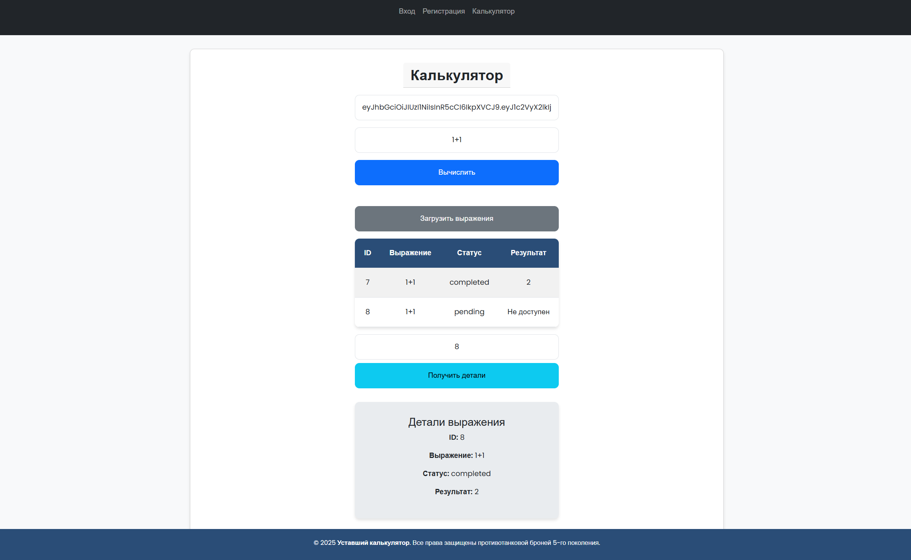
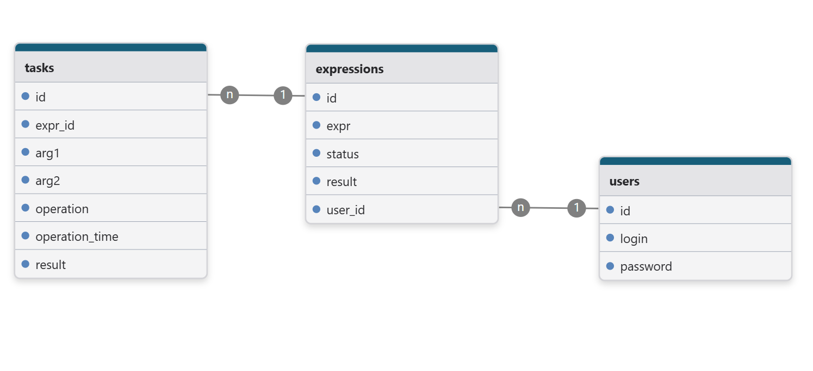
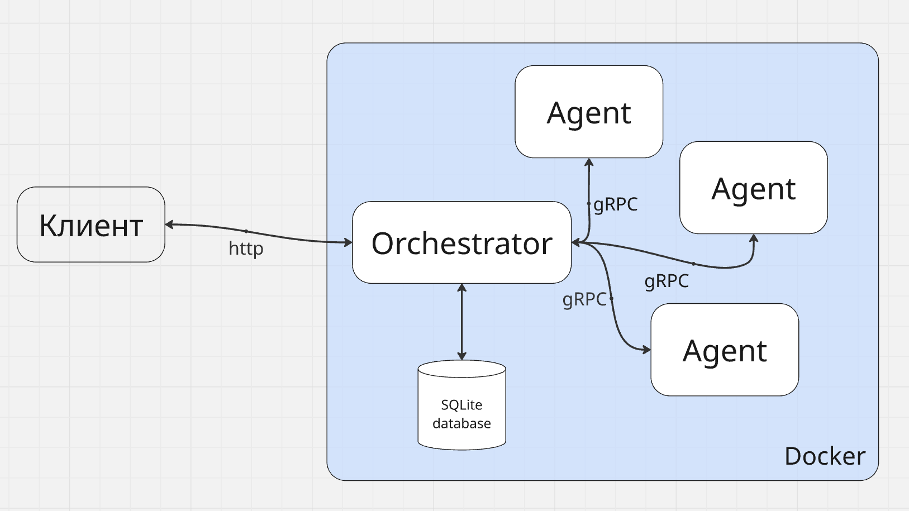

# 🧮 Уставший калькулятор от Павла (Tired Calc)



Привет, братуха!  
Этот ридми пишет **очень уставший Павел**, но несмотря на усталость, я буду рад, если тебе понравится мой калькулятор.

> ℹ️ **Связь со мной:** пиши в Telegram — [@PvlKud](https://t.me/PvlKud)  
> ✅ **Есть веб-интерфейс!** Не парься с curl, просто юзай его — он на фото выше.

---

## 🚀 Возможности

- 🗃️ Хранение выражений в SQLite (через GORM) — **переживает перезагрузку**
- 🔗 Агент и Оркестратор общаются через **gRPC**
- 🔐 Авторизация и регистрация через **JWT**
- 👤 Пользователь видит **только свои** выражения
- 🧠 Выражения можно создавать и получать **только будучи авторизованным**

---

## 📦 Установка и запуск вручную

### 🔧 Требования

- Go **v1.20.0+**
- Установленные зависимости (`zap`, `gorm` и др.)

### 🛠️ Шаги

1. Клонируй репозиторий:

   ```bash
   git clone https://github.com/PavelFr8/Golang-Calc.git
   cd Golang-Calc
   ```

2. Установи зависимости:

   ```bash
   go mod tidy
   ```

3. Скопируй файл переменных окружения:

   **Linux/Mac:**

   ```bash
   cp example.env .env
   ```

   **Windows:**

   ```bash
   copy example.env .env
   ```

4. Запусти **агент**:

   ```bash
   go run ./cmd/agent/main.go
   ```

5. В **отдельном терминале** запусти **оркестратор**:

   ```bash
   go run ./cmd/orchestrator/main.go
   ```

> ✅ Через пару секунд всё будет работать на [http://localhost:8080](http://localhost:8080)

---

## 🐳 Запуск через Docker

> ⚠️ Использовался Docker для **WSL**. Если есть ошибки — попробуй очистить всё: `docker system prune -a --volumes`

1. Клонируй репозиторий:

   ```bash
   git clone https://github.com/PavelFr8/Golang-Calc.git
   cd Golang-Calc
   ```

2. Собери и запусти контейнеры:

   ```bash
   docker-compose build
   docker-compose up
   ```

> ✅ Через пару секунд всё будет работать на [http://localhost:8080](http://localhost:8080)

---

## 🧪 Тестирование

> ✅ Реализованы модульные и интеграционные тесты

> `handlers_test.go` - интеграционный тест и проверяет целиком логику работы Оркестратора

> `agemt_mock_test.go` - интеграционный тест и проверяет целиком логику работы Агента(В данном тесте оркестартор подменяется фейковым mock-сервером)

> Остальные тесты модульные и проверяют работу отдельных модулей и функций

```bash
go test ./...
```

---

## 📬 Примеры запросов через curl

> ⚠️ **Совет от автора:** пользуйтесь **Postman** — это сбережёт вам кучу нервов 😄

> ✅ **Важно:** указывайте JWT-токен в Header:
> `Authorization: Bearer <ВАШ_ТОКЕН>`

---

### 🔐 Регистрация

```bash
curl -X POST http://localhost:8080/api/v1/register \
  -H "Content-Type: application/json" \
  -d '{"login": "pasha", "password": "1234"}'
```

### 🔑 Логин

```bash
curl -X POST http://localhost:8080/api/v1/login \
  -H "Content-Type: application/json" \
  -d '{"login": "pasha", "password": "1234"}'
```

### ➕ Добавление выражения

```bash
curl -X POST http://localhost:8080/api/v1/calculate \
  --header "Authorization: Bearer <JWT_TOKEN>" \
  -H "Content-Type: application/json" \
  -d '{"expression": "3 * 4"}'
```

### 📄 Получить список выражений

```bash
curl http://localhost:8080/api/v1/expressions \
  --header "Authorization: Bearer <JWT_TOKEN>"
```

---

## 🧠 Схемы

### [Схема БД](https://www.drawdb.app/editor?shareId=73967a1adebeca62b1f2edef94ce2b1f)



### Схема работы



---

> 🧡 Спасибо, что дочитал до конца!
> Надеюсь, мой проект оказался полезным или хотя бы прикольным.
> Напиши, если будут идеи или баги :)
