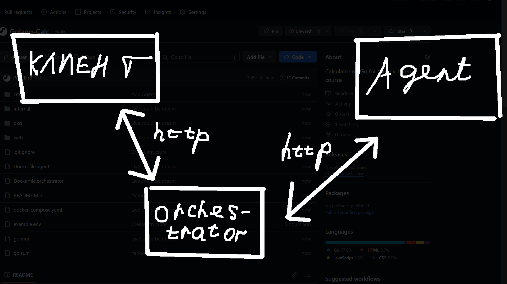

# Уставший калькулятор от Павла (Tired Calc)

Привет братуха! Этот ридми пишет очень уставший Павел, но несмотря на усталость, я буду рад, если тебе понравится мой калькулятор. Если будут какие-то проблемы, то пиши в тг @PvlKud. Всё, удачи!

А нет, я ещё написал веб-интерфейс, поэтому если захочешь протестить, то не парься и просто юзай его.

## Инструкция по запуску

### Требования

- Go версии 1.20.0 или выше
- Установленный zap

### Установка и запуск

1. Клонируйте репозиторий:

   ```bash
   git clone https://github.com/PavelFr8/Golang-Calc.git
   cd Golang-Calc
   ```

2. Установите библиотеки:

   ```bash
   go mod tidy
   ```

3. Скопируйте файл с примером переменных окружения:

  Для Linux/Mac:

  ```bash
  cp example.env .env
  ```

  Для Windows:

  ```bash
  copy example.env .env
  ```

4. Запустите агент:

   ```bash
   go run ./cmd/agent/main.go
   ```

4. Запустите оркестратор в другом терминале(или потоке):

   ```bash
   go run ./cmd/orchestrator/main.go
   ```

5. Сервис будет запущен на `http://localhost:8080.`.

## Запуск через Docker

Хз почему, то веб-интерфейс при запуске через докер перестает работать :(

1. Клонируйте репозиторий:

   ```bash
   git clone https://github.com/PavelFr8/Golang-Calc.git
   cd Golang-Calc
   ```

2. Скопируйте файл с примером переменных окружения:

  Для Linux/Mac:

  ```bash
  cp template.env .env
  ```

  Для Windows:

  ```bash
  copy template.env .env
  ```

3. Запустите Docker:

   ```bash
   docker-compose build  
   docker-compose up
   ```

## Тестирование

```bash
go test ./...
```

## Пример работы через curl

### 1. Добавить выражение

```bash
curl -X POST http://localhost:8080/api/v1/calculate -H "Content-Type: application/json" -d '{"expression": "3 * 4"}'
```

### 2. Получить все выражения

```bash
curl http://localhost:8080/api/v1/expressions
```

### 3. Получить задачу для агента

```bash
curl http://localhost:8080/internal/task
```

### 4. Завершить задачу

```bash
curl -X POST http://localhost:8080/internal/task -H "Content-Type: application/json" -d '{"id": "1", "result": 12.0}'
```

### 5. Проверить результат

```bash
curl http://localhost:8080/api/v1/expressions
```

## Схема работы

